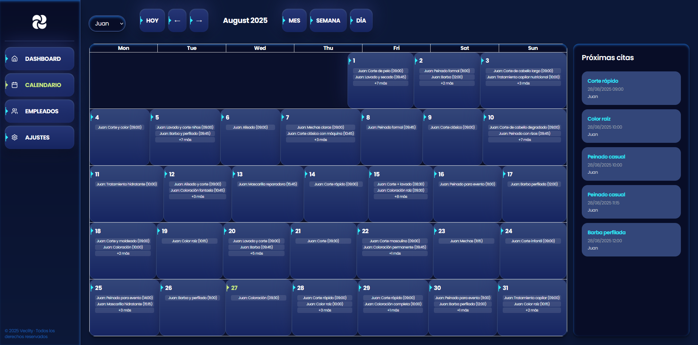
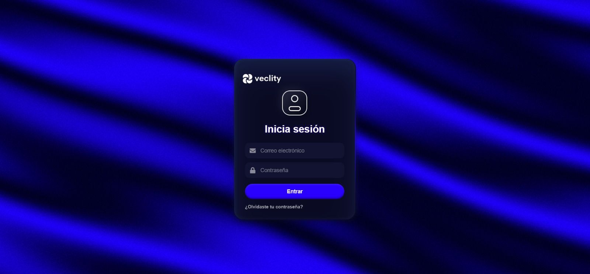

# 🚀 Veclity — AI Appointment Management System

**Role:** Fullstack Developer (Frontend, Backend, AI Integration)  
**Tech Stack:** React, React Native, Node.js, Express, PostgreSQL, OpenAI API, WhatsApp Web.js, Render  

---

## 🧠 Project Overview

**Veclity** is an AI-powered appointment management platform that allows users and businesses to schedule, modify, and cancel reservations seamlessly through both a web app and WhatsApp.  
The system integrates **natural language processing (NLP)** to understand user messages and manage appointments automatically without human intervention.  

I developed the entire backend, AI logic, WhatsApp integration, and both the mobile and web frontends.  

---

## 📱 Mobile App

Built with **React Native + Expo**, the mobile app allows users to:  
- **Login / Register:** Secure authentication flow.  
- **View Calendar:** Display existing appointments.  
- **Add, Edit, and Delete Appointments:** Full CRUD functionality from mobile.  
- **Sync with Backend:** All actions are synchronized with the main database in real time.  

The app serves as a lightweight version of the web interface, focused mainly on appointment management.  

---

## 💻 Web Application

Developed using **React (Vite + TailwindCSS + React Router)**, the web platform includes all features of the mobile app plus additional advanced tools:  
- **AI Chatbot Panel:** Users can enable or disable the AI WhatsApp assistant.  
- **Appointment Management:** Create, modify, and delete bookings through an intuitive calendar interface.  
- **Admin Dashboard:** Manage users, view analytics, and control AI settings.  
- **Responsive UI:** Adaptive layout for all screen sizes.  

---

## ⚙️ Backend

Developed in **Node.js + Express**, the backend handles:  
- **User Authentication**  
- **Appointment CRUD Operations**  
- **AI Assistant Integration (OpenAI API)**  
- **WhatsApp Integration (WhatsApp Web.js)**  
- **Database Operations (PostgreSQL)**  

Hosted entirely on **Render free-tier**, including the **PostgreSQL database** and **API server**.  

---

## 🤖 AI Integration (OpenAI API)

The backend integrates with the **OpenAI API** to process and understand natural language messages from users via WhatsApp.  
Each incoming WhatsApp message is mapped, processed by the model, and assigned to a specific chat with context retention — enabling the system to respond naturally, understand modifications, and handle scheduling intelligently.  

---

## 💬 WhatsApp Integration (WhatsApp Web.js)

Veclity connects directly to **WhatsApp Web.js**, allowing real-time two-way communication.  
- Handles incoming messages automatically.  
- Synchronizes user chats with backend logic.  
- Creates independent conversation contexts per user.  
- Sends dynamic AI-generated responses based on the OpenAI API.  

This integration enables full automation of appointment management directly from WhatsApp.  

---

## 🗄️ Database

- **Database Engine:** PostgreSQL  
- **Hosting:** Render (Free-tier)  
- **Data Model:** Users, Appointments, Conversations, Messages  

---

## 🚀 Key Features

- AI-driven appointment scheduling and modification via WhatsApp.  
- Full CRUD operations from both mobile and web apps.  
- Independent AI chat contexts for each user.  
- Real-time synchronization between web, mobile, and WhatsApp.  
- Admin dashboard with analytics and user control.  
- Secure authentication system.  
- Hosted entirely on Render’s free-tier infrastructure.  

---

## 🧩 Challenges and Solutions

1. **WhatsApp Web.js Integration:**  
   Mapping and synchronizing each chat message without Twilio required low-level handling of sessions and message events.  
2. **Natural Language Understanding:**  
   Combining OpenAI responses with structured logic for appointments demanded precise message parsing.  
3. **State Synchronization:**  
   Keeping web, mobile, and WhatsApp states aligned was achieved through consistent API design and PostgreSQL transactions.  
4. **Render Free-tier Limits:**  
   Optimized database queries and asynchronous tasks to stay within resource limits.  

---

## 👨‍💻 Author

**Jolmo**  
[Portfolio Link]  
[GitHub Link]  

---

## 🏁 Summary

Veclity demonstrates a complete **AI + Fullstack project** integrating:  
- Multi-platform (Web + Mobile) development  
- Real-time AI-driven automation via WhatsApp  
- Backend with OpenAI and PostgreSQL  
- Cloud deployment using Render  

This project showcases both strong **software engineering** and **AI system design** skills — from UX to backend automation and cloud integration.
